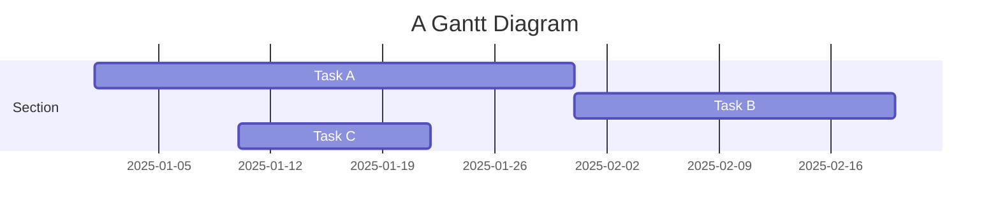

## Equations

This theme supports rendering beautiful math in inline and display modes using [MathJax 3](https://www.mathjax.org/) engine.
You just need to surround your math expression with `$$`, like `$$ E = mc^2 $$`.
If you leave it inside a paragraph, it will produce an inline expression, just like $$ E = mc^2 $$.

In fact, you can also use a single dollar sign `$` to create inline formulas, such as `$ E = mc^2 $`, which will render as $ E = mc^2 $.

To use display mode, again surround your expression with `$$` and place it as a separate paragraph.
Here is an example:

$$
\left( \sum_{k=1}^n a_k b_k \right)^2 \leq \left( \sum_{k=1}^n a_k^2 \right) \left( \sum_{k=1}^n b_k^2 \right)
$$

---

## Citations

Citations are then used in the article body with the `<d-cite>` tag.
The key attribute is a reference to the id provided in the bibliography.
The key attribute can take multiple ids, separated by commas.

The citation is presented inline like this: <d-cite key="gregor2015draw"></d-cite> (a number that displays more information on hover).

---

## Footnotes

Just wrap the text you would like to show up in a footnote in a `<d-footnote>` tag.
The number of the footnote will be automatically generated.<d-footnote>This will become a hoverable footnote.</d-footnote>

---

## Code Blocks

Syntax highlighting is provided within `<d-code>` tags.
An example of inline code snippets: `<d-code language="html">let x = 10;</d-code>`.
For larger blocks of code, add a `block` attribute:

<d-code block language="javascript">
  var x = 25;
  function(x) {
    return x * x;
  }
</d-code>

You can also write standard Markdown code blocks in triple ticks with a language tag:

```python
def foo(x):
  return x
```

---

## Interactive Plots

You can add interative plots using plotly + iframes :framed_picture:

<div class="l-page">
  <iframe src="{{ '/assets/plotly/demo.html' | relative_url }}" frameborder='0' scrolling='no' height="500px" width="100%" style="border: 1px dashed grey;"></iframe>
</div>

---

## Mermaid

This theme supports creating diagrams directly in markdown using [Mermaid](https://mermaid.js.org/). Mermaid enables users to render flowcharts, sequence diagrams, class diagrams, Gantt charts, and more. Simply embed the diagram syntax within a mermaid code block.



---

## Chartjs, Echarts and Vega-Lite

[Chart.js](https://www.chartjs.org/) is a versatile JavaScript library for creating responsive and interactive charts.

```chartjs
{
  "type": "bar",
  "data": {
    "labels": ["2017", "2018", "2019", "2020", "2021"],
    "datasets": [
      {
        "label": "Population (millions)",
        "data": [12, 15, 13, 14, 16],
        "backgroundColor": "rgba(54, 162, 235, 0.6)",
        "borderColor": "rgba(54, 162, 235, 1)",
        "borderWidth": 1
      }
    ]
  },
  "options": {
    "scales": {
      "y": {
        "beginAtZero": true
      }
    }
  }
}
```

[ECharts](https://echarts.apache.org/) is a powerful visualization library from [Apache](https://www.apache.org/) that supports a wide range of interactive charts.

[Vega-Lite](https://vega.github.io/vega-lite/) is a declarative visualization grammar that allows users to create, share, and customize a wide range of interactive data visualizations.

```vega_lite
{
  "$schema": "https://vega.github.io/schema/vega/v5.json",
  "width": 400,
  "height": 200,
  "padding": 5,
  "data": [
    {
      "name": "table",
      "values": [
        {"category": "A", "value": 28},
        {"category": "B", "value": 55},
        {"category": "C", "value": 43},
        {"category": "D", "value": 91}
      ]
    }
  ],
  "scales": [
    {
      "name": "xscale",
      "type": "band",
      "domain": {"data": "table", "field": "category"},
      "range": "width",
      "padding": 0.1
    },
    {
      "name": "yscale",
      "type": "linear",
      "domain": {"data": "table", "field": "value"},
      "nice": true,
      "range": "height"
    }
  ],
  "axes": [
    {"orient": "bottom", "scale": "xscale"},
    {"orient": "left", "scale": "yscale"}
  ],
  "marks": [
    {
      "type": "rect",
      "from": {"data": "table"},
      "encode": {
        "enter": {
          "x": {"scale": "xscale", "field": "category"},
          "width": {"scale": "xscale", "band": 0.8},
          "y": {"scale": "yscale", "field": "value"},
          "y2": {"scale": "yscale", "value": 0},
          "fill": {"value": "steelblue"}
        }
      }
    }
  ]
}
```

---

## TikZ

[TikZ](https://tikz.net/) is a powerful LaTeX-based drawing tool powered by [TikZJax](https://tikzjax.com/).

<script type="text/tikz">
\begin{document}
  \begin{tikzpicture}
      \filldraw[fill=cyan!10, draw=blue, thick] (0,0) circle (2cm);

      \draw[->, thick] (-2.5,0) -- (2.5,0) node[right] {Re};
      \draw[->, thick] (0,-2.5) -- (0,2.5) node[above] {Im};

      \draw[->, thick, color=purple] (0,0) -- (1.5,1.5);
      \node[color=purple] at (1.1, 1.7) {$e^{i\theta}$};
  \end{tikzpicture}
\end{document}
</script>

---

## Other Typography?

Emphasis, aka italics, with _asterisks_ (`*asterisks*`) or _underscores_ (`_underscores_`).

Strong emphasis, aka bold, with **asterisks** or **underscores**.

1. First ordered list item
2. Another item

- Unordered list can use asterisks
- Or minuses
- Or pluses

[I'm an inline-style link](https://www.google.com)

Inline `code` has `back-ticks around` it.
